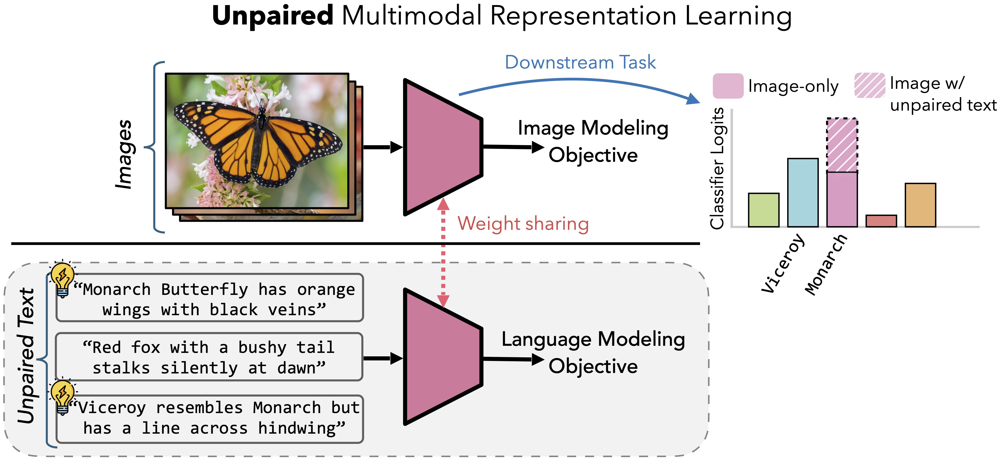
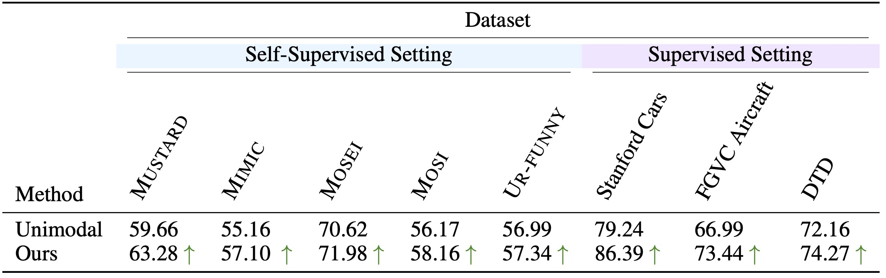

# Better Together: Leveraging Unpaired Multimodal Data for Stronger Unimodal Models
#### [Project Page](https://unpaired-multimodal.github.io/) | [Paper]() | [Bibtex](#bibtex)

By [Sharut Gupta](https://www.mit.edu/~sharut/)$^{\dagger}$, [Shobhita Sundaram](https://ssundaram21.github.io/)$^{\dagger}$, [Chenyu Wang](https://chenyuwang-monica.github.io/)$^{\dagger}$, [Stefanie Jegelka](https://people.csail.mit.edu/stefje/)$^{\dagger \ddagger}$ and [Phillip Isola](https://web.mit.edu/phillipi/)$^{\dagger}$

$^\dagger$ MIT, $^\ddagger$ TU Munich

---

## Abstract
Traditional multimodal learners find unified representations for tasks like visual question answering, but rely heavily on paired datasets. However, an overlooked yet potentially powerful question is: can one leverage auxiliary *unpaired* multimodal data to directly enhance representation learning in a *target* modality? We introduce **UML**: **U**npaired **M**ultimodal **L**earner, a modality-agnostic training paradigm in which a single model alternately processes inputs from different modalities while sharing parameters across them. This design exploits the assumption that different modalities are projections of a shared underlying reality, allowing the model to benefit from cross-modal structure without requiring explicit pairs. Theoretically, under linear data-generating assumptions, we show that unpaired auxiliary data can yield representations strictly more informative about the data-generating process than unimodal training. Empirically, we show that using unpaired data from auxiliary modalities—such as text, audio, or images—consistently improves downstream performance across diverse unimodal targets such as image and audio. 


The key contributions of this work include:
- Introducing UML, a modality-agnostic framework that leverages unpaired data to improve unimodal models. We test it across self-supervised and supervised encoders (CLIP, DINOv2, OpenLLaMA, and others), in both few-shot and full-data regimes, showing consistent gains over a range of image-text benchmarks and extensions to audio.
- Theoretically characterizing, under linear assumptions, the conditions where unpaired data yield strictly more informative representations than unimodal training. Remarkably, the conversion ratio between modalities can fall below one: in certain regimes, a single sample from $Y$ contributes more to modeling $X$ than an additional sample from $X$ itself.
- Quantifying conversion ratios between images and text i.e., how many words is an image worth for training vision models. We also show that unpaired multimodal data systematically widens inter-class margins and aligns modalities in weights.


## Installation and Setup 

We provide a complete environment configuration file that includes all necessary dependencies required packages. Clone the repository and install dependencies:


```bash
git clone https://github.com/sharut/Unpaired-MultiModal-Alignment.git
cd Unpaired-MultiModal-Alignment
conda env create -f environment.yml
conda activate uml
```

---

## Repository Structure

This repository is organized into two main experimental setups:

```
.
├── vision_language/            # Vision-Language experiments
│   ├── features.py             # Feature extraction from pre-trained models
│   ├── finetune.py             # Main training script for fine-tuning
│   ├── generate_fewshot.py     # Generate few-shot dataset splits
│   ├── engine/                 # Core implementation of model, datasets, loaders etc.
│   ├── descriptions/           
│   │   └── cupl/               # CUPL descriptors for datasets
│
└── MultiBench/                 # MultiBench experiments
    ├── main.py                 # Main file for MultiBench experiments
    ├── train.py                # Training logic and UML implementation
    ├── models.py               # Model architectures
    ├── datasets/               # Dataset loaders for various tasks
    ├── robustness/             # Robustness testing utilities
    ├── data_files/             # Preprocessed data files
```

---

## Datasets and Benchmarks

We provide two main experimental setups:

**Vision-Language Benchmarks**: Standard vision-language classification benchmarks include:
- **ImageNet** and variants (ImageNet-A, ImageNet-R, ImageNet-Sketch, ImageNetV2)
- **Fine-grained classification**: Caltech101, Oxford Pets, Oxford Flowers, Stanford Cars, FGVC Aircraft, Food101
- **Texture and scene recognition**: DTD (Describable Textures), SUN397
- **Action recognition**: UCF101

Follow the instructions from [cross_modal_adaptation](https://github.com/linzhiqiu/cross_modal_adaptation)'s `datasets.md` to download and prepare the datasets.

**MultiBench**: MultiBench provides diverse multimodal datasets spanning 
- **Affective computing**: [MUStARD](https://drive.google.com/drive/folders/1JFcX-NF97zu9ZOZGALGU9kp8dwkP7aJ7?usp=sharing), [CMU-MOSI](https://drive.google.com/drive/folders/1uEK737LXB9jAlf9kyqRs6B9N6cDncodq?usp=sharing), [CMU-MOSEI](https://drive.google.com/drive/folders/1A_hTmifi824gypelGobgl2M-5Rw9VWHv?usp=sharing), [UR-FUNNY](https://drive.google.com/drive/folders/1Agzm157lciMONHOHemHRSySmjn1ahHX1?usp=sharing)
- **Healthcare**: MIMIC
- and more

Follow the instructions from [MultiBench](https://github.com/pliang279/MultiBench)'s official github repository to download dataset files into `MultiBench/data_files/`. We used encoders and preprocessed features provided by the MultiBench repository. You can obtain processed data with `datasets/affect/get_data.py`, note that `sarcasm` means [MUsTARD](https://github.com/soujanyaporia/MUStARD) and `humor` means [UR-FUNNY](https://github.com/ROC-HCI/UR-FUNNY).
You can also train the model using raw data and other encoders designs. The original datasets are also publicly available at [MultimodalSDK](https://github.com/matsuolab/CMU-MultimodalSDK) for MOSI and MOSEI, MUsTARD and UR-Funny. 

## Usage
### (A) Vision-Language Benchmarks (Supervised Signal)
Here, we train UML under supervision from class labels. Specifically, we assume access to class labels $c_X$ for $x$ (say image) and $c_Y$ for $y$ (say text) and train a shared classifier $c(\cdot)$ on top of embeddings of $x$ and $y$ using modality-specific classification loss. Our implementation is based on [cross_modal_adaptation](https://github.com/linzhiqiu/cross_modal_adaptation) and supports experiments with various architectures (CLIP, DINOv2, OpenLLaMA). 

#### Configure Paths

After downloading datasets, configure the paths at `vision_language/engine/config/defaults.py`:

```bash
cd vision_language
vim engine/config/defaults.py
```

#### Dataset splits
To download existing  few-shot train/val splits for reproducibility, use the splits provided at `https://github.com/linzhiqiu/cross_modal_adaptation/tree/main/indices`. Splits are provided across seeds (1,2 and 3), shots (1, 2, 4, 8 and 16) and datasets (10 benchmarks) for reproducibility. If using provided splits, download them into `indices/` and set `FEW_SHOT_DIR` in `engine/config/defaults.py`. If you need different seeds or shot numbers, use `generate_fewshot.py`, example: 

```bash
python generate_fewshot.py -d --dataset fgvc_aircraft --train-shot 32 --seed 4
```

#### Feature Extraction
For faster training and efficient hyperparameter sweeps, we pre-extract features from frozen encoders. This is particularly useful for few-shot  linear probe or full finetuning experiments. To extract features for the whole dataset (`train_shot=-1`) using ViT-S/14 DINOv2 as the vision encoder and OpenLLaMA-3B as the text encoder,

```python
python features.py \
    --dataset fgvc_aircraft \
    --train-shot -1 \
    --seed 1 \
    --batch_size 8 \
    --descriptor_type gpt3_cupl \
    --text_augmentation vanilla
    --vision_model 'vit_small_patch14_dinov2.lvd142m' \
    --language_model 'openlm-research/open_llama_3b_v2'
```
To use CLIP vision and language encoders, use
```python
python features.py \
    --dataset fgvc_aircraft \
    --train-shot -1 \
    --seed 1 \
    --batch_size 8 \
    --descriptor_type gpt3_cupl \
    --clip_encoder 'ViT-B/16' 
```

#### Training
Train models using either configuration files (efficient for sweeps) or command-line arguments. Edit `configs/finetune.yaml` to specify your hyperparameter sweep or directly run,

```python
python finetune.py \
    --dataset fgvc_aircraft \
    --train-shot -1 \
    --seed 1 \
    --vision-model vit_small_patch14_dinov2.lvd142m \
    --language-model openlm-research/open_llama_3b_v2 \
    --modality crossmodal \
    --alpha 1.0 \
    --hyperparams full_ds_full_model_finetune \
    --image-augmentation crop \
    --eval-test
```
To train unimodal models, use `--modality=image`. To train on the whole dataset use `--train-shot=-1` and for few-shot training, set `--train-shot` to the respective shot. While the code currently freezes the language model and trains the pretrained vision backbone and shared head, one can also freeze the vision backbone and only train the shared head to conduct linear probe experiments (as reported in our paper). 
After training, results are saved in the `experiments/` directory with logs and checkpoints.

---

### (B) MultiBench Benchmarks (Self-Supervised Signal)

Training hyperparameters are controlled via YAML configuration files. Edit `MultiBench/configs/train.yaml` to run sweep over parameters. To directly run using command line arguments, use 

```python
python main.py \
    --ds_name sarcasm \
    --modality xy \
    --lr 1e-4 \
    --zdim 40 \
    --num_epochs 30 \
    --step_k -1 \
    --n_seeds 3 \
    --pos_embd \
    --pos_learnable
```

---
## Results



---

## Tips and Best Practices

#### For Vision-Language Experiments

- Start with pre-extracted features for faster iteration during hyperparameter tuning
- Try different alpha values (0.0, 0.3, 0.5, 0.7, 1.0, 1.5) to find optimal cross-modal weighting
- Use GPT-3 descriptors (`text_type='gpt3_cupl'`) for better text representations
- Conduct rigourous hyperparameter testing over learning rate, weight decay etc. to get optimal results. 

#### For MultiBench Experiments

- Try different `step_k` values: -1 (for jointly training on $X$ and $Y$ from the first step), 10, 20 etc to first warm start the model on $Y$ alone for `step_k` epochs and then jointly training on $X$ and $Y$ (without supervision)
- Adjust `zdim` based on dataset complexity: smaller datasets need smaller zdim to avoid overfitting

---

<a name="bibtex"></a>
## Citation

If you find this work useful, please cite:

```bibtex
@article{gupta2025better,
  title={Better Together: Leveraging Unpaired Multimodal Data for Stronger Unimodal Models},
  author={Gupta, Sharut and Sundaram, Shobhita and Wang, Chenyu and Jegelka, Stefanie and Isola, Phillip},
  journal={arXiv preprint},
  year={2025}
}
```

---
